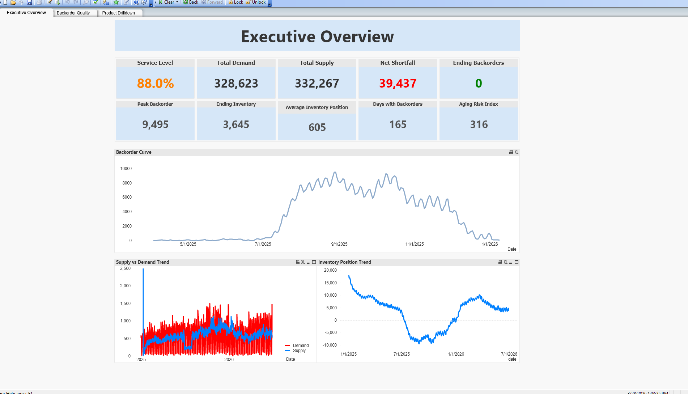

# QlikView Demand Planning KPI Training Dashboard

## Executive Summary

To support analyst onboarding and standardize how the team approached KPI reporting, my manager commissioned me to create a synthetic dataset and build a QlikView training dashboard aligned to the company’s official KPI template. Because real operational data was restricted and not suitable for training, the synthetic dataset allowed me to model realistic business scenarios, inject controlled anomalies, and demonstrate how to structure data for QlikView’s associative engine.

The resulting dashboard serves as a hands‑on training tool that teaches new analysts how to connect data sources, apply transformations, calculate KPIs, and design dashboards that follow internal UI/UX standards. It provides a complete, end‑to‑end example of how to turn raw data into actionable insights using QlikView.

Based on the training objectives, the dashboard demonstrates:
- How to structure fact and dimension tables for QlikView
- How to calculate and visualize core KPIs
- How to design dashboards that follow internal layout and spacing standards
- How to validate data quality and test analytical logic
- How to interpret trends, segments, and performance indicators

## Business Problem

The analytics team needed a consistent, scalable way to train new analysts on:
- QlikView fundamentals
- The company’s KPI definitions and reporting standards
- Data transformation and validation practices
- How to interpret and communicate insights
- How to build dashboards that meet internal design guidelines

However, real operational data could not be used due to:
- Privacy and compliance restrictions
- Incomplete or messy datasets not suitable for training
- The need to model specific scenarios and edge cases
- The desire to teach analysts in a controlled, risk‑free environment

The goal was to build a realistic but safe training environment that mirrored the company’s analytical workflows without relying on production systems.

## Methodology

### Synthetic Data Generation
- Created a dataset that mirrored real business dynamics, including product hierarchies, time periods, seasonality, and performance variation.
- Injected controlled anomalies to teach analysts how to identify outliers and validate data quality.
- Ensured the dataset aligned with the company’s KPI definitions and reporting structure.

### Data Transformation & Modeling
- Structured the dataset for QlikView’s associative model using fact tables, dimension tables, and key fields.
- Applied data cleaning, normalization, and formatting to simulate real‑world ETL processes.
- Documented data definitions and metadata to support training and consistency.

### KPI Engineering
- Calculated core KPIs used across the organization, including:
  1. Volume trends
  2. Performance ratios
  3. Variance vs. target
  4. Segment‑level comparisons

- Ensured KPI logic matched the company’s official reporting template.

### QlikView Dashboard Development
- Built a multi‑section dashboard demonstrating:
  1. KPI tiles
  2. Trend charts
  3. Segmentation views
  4. Drill‑down interactions
  5. Filter panels and associative selections

- Applied UI/UX best practices including hierarchy, spacing, color standards, and layout consistency.

- Created guided examples to teach analysts how to interpret each visualization.

## Skills
- QlikView: Data modeling, associative logic, set analysis, KPI tiles, drill‑downs, UI/UX design
- Data Engineering: Synthetic data creation with AI assistance, normalization, metadata documentation, ETL simulation
- Analytics: KPI design, trend analysis, segmentation, anomaly detection
- Data Visualization: Layout design, hierarchy, color theory, user‑centric dashboarding
- Training & Enablement: Instructional design, scenario creation, onboarding support

## Results and Training Impact
The training dashboard delivered several key benefits:
- Standardized onboarding: New analysts learned QlikView and KPI logic in a structured, controlled environment.
- Consistent KPI interpretation: Reinforced the company’s official definitions and reporting standards.
- Hands‑on learning: Analysts practiced building filters, exploring data, and interpreting trends without risk to production systems.
- Reusable training asset: The dataset and dashboard became part of the team’s permanent onboarding toolkit.
- Improved analytical readiness: Analysts ramped faster and produced more consistent, accurate reporting.

## Recommendations
- Expand the synthetic dataset to include additional business scenarios and edge cases.
- Add guided exercises that walk analysts through building their own QlikView sheets.
- Integrate the training dashboard into a broader analytics onboarding curriculum.
- Create a version of the dataset for Power BI to support cross‑tool training.
- Develop automated scripts to regenerate synthetic data for future training cycles.

## Next Steps
- Incorporate anonymized real data once governance allows, enabling hybrid training.
- Add scenario‑based challenges (e.g., “identify the root cause of this KPI drop”).
- Build a troubleshooting module that teaches analysts how to validate data quality.
- Create a companion documentation package including a data dictionary and KPI glossary.
